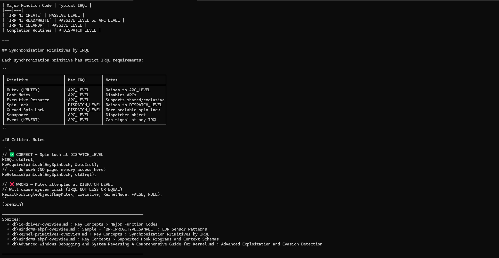
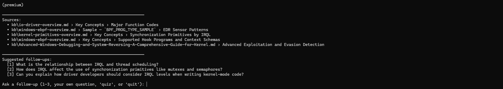
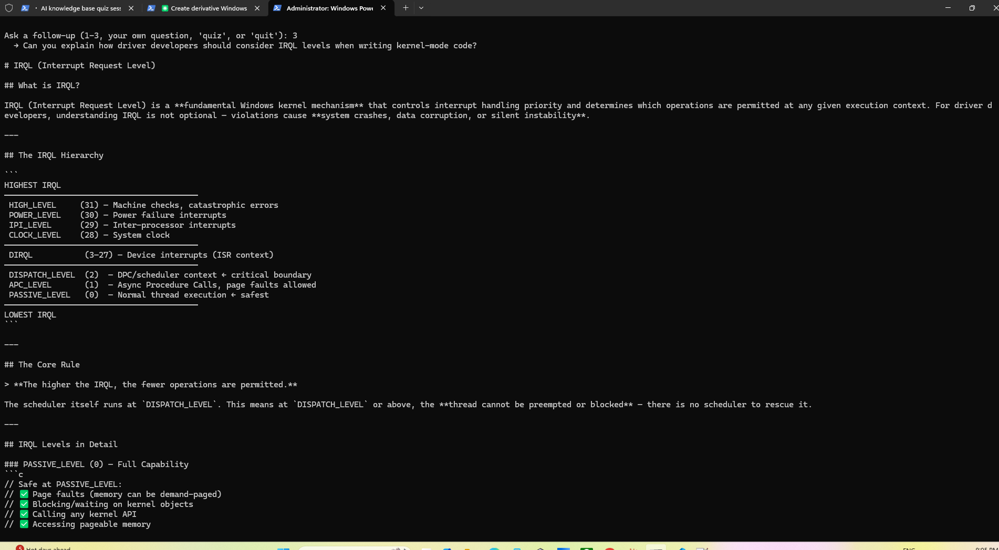
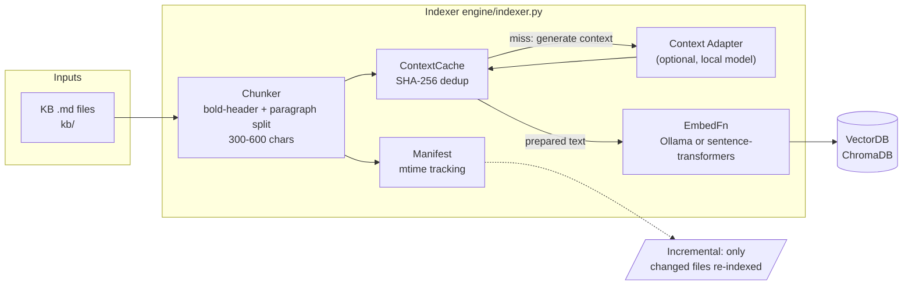
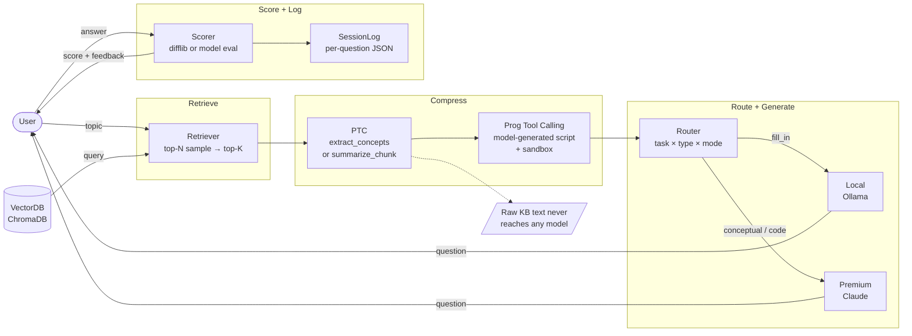
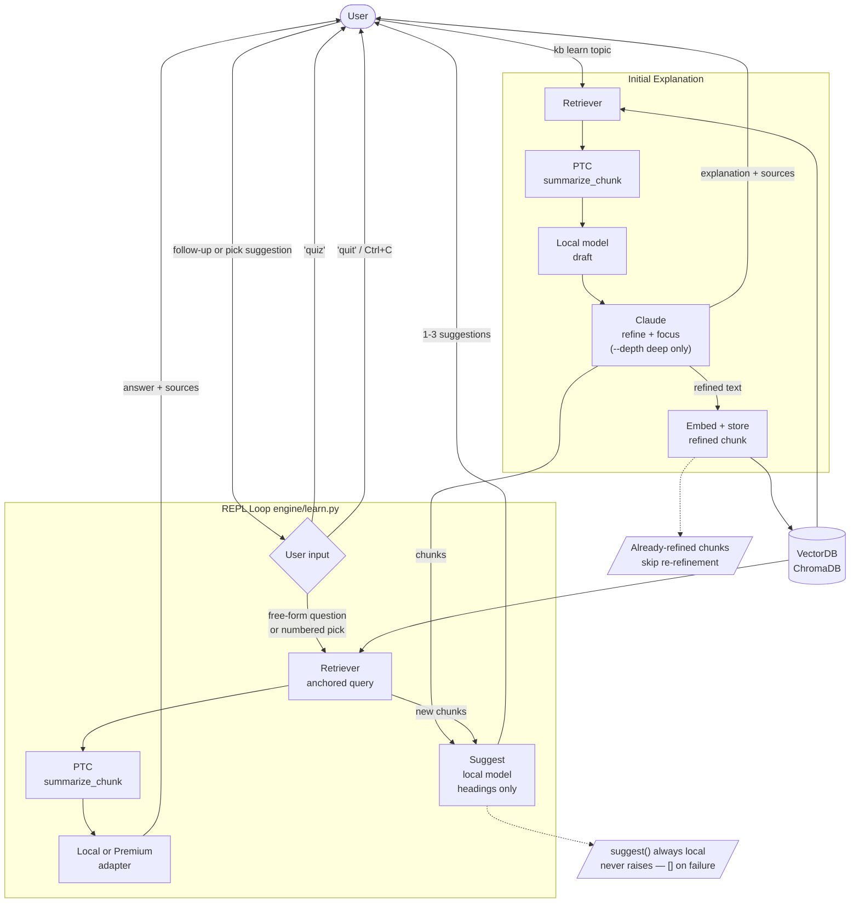

# ai-kb-quiz

> A hybrid multi-model CLI for quizzing and interactive learning over a vectorized knowledge base.

## What it demonstrates

- **Hybrid model routing** — routes tasks to a local CPU model (Ollama) or premium model (Claude) based on complexity and config; runs in `local`, `premium`, or `hybrid` mode
- **PTC (Process-Then-Communicate)** — developer-authored extraction scripts compress KB context before every model call; raw KB text never reaches any model
- **Interactive learning REPL** — `kb learn` delivers a structured explanation then enters a follow-up loop; local model generates grounded suggestions from chunk headings after each response
- **Premium sanitization** — `--depth deep` uses Claude to refine the local model draft, then stores the refined output back into ChromaDB so future sessions retrieve clean summaries first
- **Vectorized semantic search** — ChromaDB-backed retrieval with configurable embedding backends (Ollama or sentence-transformers), fine-grained sub-heading chunking (300–600 chars), top-N candidate pool with random sampling for session diversity
- **Extensible KB** — add a markdown file, run `kb index`, new content is immediately available

## Why hybrid multi-model?

Three reasons drive the local + premium split:

**1. Grounded responses, no hallucinations**
Every model call receives only PTC-compressed KB excerpts — never free-form prompts about a topic from memory. The model can only reason over what the KB actually says, so answers stay factual and cited.

**2. Cost control**
Routine tasks (suggestions, fill-in questions, follow-up drafts) run entirely on a local Ollama model — zero API cost. Claude is invoked only for `--depth deep` refinement, where output quality justifies the spend.

**3. Sensitive KB stays on-device**
Raw KB content never leaves the machine. PTC scripts compress it to minimal structured text before any network call, and local-only mode (`mode: local` in config) routes everything through Ollama with no outbound traffic at all.

---

## Prerequisites

| Requirement | Notes |
|---|---|
| Python 3.10+ | 3.12+ recommended |
| [Ollama](https://ollama.com) | Local model inference + embeddings |
| Ollama models | See table below |
| Anthropic API key | Only for `--depth deep`; optional |

**Pull required Ollama models:**

```bash
# Embedding model (required for indexing and search)
ollama pull nomic-embed-text

# Inference model — choose based on your hardware
ollama pull qwen2.5:14b        # recommended: 14B, ~8.7 GB VRAM
ollama pull phi4:14b           # alternative: structured output, ~8.5 GB VRAM

# CPU-only / low-RAM machines
ollama pull phi4-mini          # 3.8B, ~3.5 GB RAM
ollama pull llama3.2:3b        # 3B, ~3.0 GB RAM
```

---

## Installation

```bash
# 1. Clone the repo
git clone https://github.com/mailtocsprasad/ai-kb-quiz.git
cd ai-kb-quiz

# 2. Install the package and all dependencies
pip install -e ".[dev]"
```

---

## Configuration

```bash
# Copy the example config and edit it
cp config/config.example.yaml config/config.yaml
```

Key settings in `config/config.yaml`:

```yaml
mode: hybrid                    # local | premium | hybrid
local_model: qwen2.5:14b        # must be pulled via ollama pull
embedding_backend: ollama       # ollama | sentence-transformers
embedding_model: nomic-embed-text

# Premium model (Claude) — optional
premium_model: claude-sonnet-4-6
api_key_file: Claude-Key.txt    # or set ANTHROPIC_API_KEY env var
```

---

## Getting started

### 1. Build the KB index

```bash
# Full build (first time or after adding many files)
ai-kb-quiz kb index --rebuild

# Incremental update (after adding / changing a single file)
ai-kb-quiz kb index
```

### 2. List indexed files

```bash
ai-kb-quiz kb list
```

Output:

```
File                                Indexed    Last Modified
-----------------------------------------------------------------
WinDbg-Complete-Technical-Reference.md  yes    2026-04-19
windows-internals.md                    yes    2026-04-16
...
```

### 3. Search the KB

```bash
ai-kb-quiz kb search "SSDT hooking"
ai-kb-quiz kb search "WinDbg breakpoints" --top 3
```

### 4. Learn interactively (REPL)

```bash
# Shallow — local model explains and suggests
ai-kb-quiz kb learn "WinDbg extension commands"

# Deep — local model drafts, Claude refines and stores the result
ai-kb-quiz kb learn "kernel debugging workflow" --depth deep
```

**Example — `kb learn "IRQL" --depth deep`:**

Explanation with IRQL hierarchy, synchronization primitive table, and code examples (Claude-refined):



Sources cited and on-topic follow-up suggestions generated from the explanation:



Picking suggestion `[3]` triggers a focused follow-up answer:



**REPL controls:**

| Input | Action |
|---|---|
| `1` / `2` / `3` | Pick a numbered follow-up suggestion |
| Any question | Ask your own follow-up |
| `quiz` | Launch a quiz on this topic |
| `quit` or Ctrl+C | End session (shows token count) |

### 5. Add / remove KB files

```bash
# Add a new markdown file and index it
ai-kb-quiz kb add path/to/my-notes.md
ai-kb-quiz kb index

# Remove a file
ai-kb-quiz kb remove old-notes.md
ai-kb-quiz kb index --rebuild
```

---

## Architecture

Three flows share the same vector index and engine components.

### Indexing — build or update the KB vector index



### Quiz — generate questions and score answers



### Learn — interactive study REPL



See [`docs/specs/`](docs/specs/) for the full ADD + ATAM design and
[`docs/specs/modules/`](docs/specs/modules/) for PlantUML sequence diagrams (E2E-00 through E2E-09).

---

## Project layout

```
ai-kb-quiz/
  kb/                       # Markdown knowledge base
  kb_index/                 # ChromaDB vector index (committed, rebuilt via kb index --rebuild)
  engine/
    question.py             # Core data types: Question, Chunk, Score, PTCResult, QuestionLog
    router.py               # Route (task_type × question_type × mode) → local | premium
    chunker.py              # Markdown → fine-grained Chunks (bold-header + paragraph split)
    embedder.py             # EmbedFn factory: Ollama /api/embed or sentence-transformers
    store.py                # ChromaDB VectorStore: add / query / delete_by_source
    manifest.py             # mtime-based file change tracking → FileDiff (new/changed/deleted)
    context_cache.py        # SHA-256 content-addressed cache for contextual embedding strings
    indexer.py              # Full + incremental KB indexer: chunk → contextualise → embed → store
    retriever.py            # Semantic search: embed query → top-N pool → random sample top-K
    ptc.py                  # PTC pipeline: select and run developer-authored extraction script
    learn.py                # LearnSession: explain / follow_up / suggest + premium sanitization
    scorer.py               # fill_in: difflib fuzzy match. conceptual/code: model eval JSON
    session_log.py          # Accumulates QuestionLog entries, flushes JSON per question
    sandbox.py              # SandboxRunner: RestrictedPython AST + Job Object (Win32)
    prog_tool_calling.py    # Programmable Tool Calling: model-generated script → validate → run
    quiz.py                 # QuizSession orchestrator: retrieve → PTC → route → generate → score
    models/
      adapter.py            # ModelAdapter Protocol + MockAdapter
      local_adapter.py      # Ollama HTTP API via injected httpx.Client
      premium_adapter.py    # Anthropic SDK; resolves key from env var then api_key_file
    ptc_scripts/
      summarize_chunk.py    # First 2 sentences per section
      extract_concepts.py   # Capitalised domain terms per heading
      extract_code_context.py  # Lines mentioning structs, APIs, typedefs
  cli/
    main.py                 # Typer CLI: kb index/add/remove/list/search/learn
  config/
    config.example.yaml     # Reference config: mode, models, embedding backend, quiz settings
  docs/
    specs/                  # Design spec (ADD + ATAM) and module-level specs
      modules/              # PlantUML class + sequence diagrams (E2E-00 through E2E-09)
    user-stories/           # Gherkin user stories (Epics 1–10)
    superpowers/
      plans/                # TDD implementation plan
  tests/
    conftest.py             # Shared fixtures: MockAdapter, tiny_kb_dir; CI marker skip hook
    unit/                   # Fast, pure, no I/O
    integration/            # Real ChromaDB, mock adapters
    e2e/                    # Typer CliRunner tests
    local/                  # Real Ollama + API tests (skipped when CI=true)
  logs/                     # Session JSON logs (gitignored)
```

---

## Knowledge Base

16 markdown files covering Windows kernel internals and debugging:

| File | Domain |
|------|--------|
| `WinDbg-Complete-Technical-Reference.md` | Complete WinDbg command reference |
| `WinDbg-Complete-Technical-Reference-StudyNotes.md` | WinDbg study notes and exam prep |
| `Advanced-Windows-Debugging-and-System-Reversing-A-Comprehensive-Guide-for-Kernel.md` | Kernel debugging and system reversing |
| `Windows-Debugging-and-EDR-Internals-Technical-Reference.md` | Debugging + EDR internals reference |
| `Windows-Kernel-Internals-Reference.md` | Windows kernel internals reference |
| `Windows-Kernel-Internals-StudyNotes.md` | Kernel internals study notes |
| `windows-internals.md` | Windows kernel architecture and telemetry |
| `windows-debugging.md` | WinDbg, kernel debugging, crash analysis |
| `windows-ebpf.md` | Windows eBPF ecosystem — summary |
| `windows-ebpf-overview.md` | Windows eBPF full reference — hooks, maps, helpers |
| `kernel-primitives-overview.md` | Object Manager, sync primitives, pool, APC |
| `process-thread-overview.md` | EPROCESS/ETHREAD, PS callbacks, PPL, injection |
| `io-driver-overview.md` | IRP lifecycle, minifilter, IOCTL, WFP callout |
| `boot-virtualization-overview.md` | Secure Boot, VBS/VTL, HVCI, KDP, Credential Guard |
| `critical-thinking-guide.md` | Systems Thinking, Pre-Mortem, 5 Whys, Fishbone |

---

## Running tests

```bash
# All tests (unit + integration + e2e), excluding tests that need real Ollama/API
pytest

# Include local Ollama/API tests (requires Ollama running)
pytest tests/local/ -v

# CI mode — local tests auto-skipped
CI=true pytest
```

---

## Implementation status

**Phase: KB + Learn pipeline complete. Quiz pipeline pending.**

### Complete

- [x] Core data types — `engine/question.py` (11 tests)
- [x] Chunker — fine-grained bold-header + paragraph split, 800-char limit (21 tests)
- [x] VectorStore — ChromaDB cosine similarity (13 tests)
- [x] Embedder — Ollama `/api/embed` + sentence-transformers (9 tests)
- [x] Manifest — mtime-based incremental tracking (8 tests)
- [x] ContextCache — SHA-256 dedup (7 tests)
- [x] Indexer — full + incremental, clears generated chunks on rebuild (9 tests)
- [x] Retriever — semantic search, top-N sampling (9 tests)
- [x] Router — hybrid model routing (11 tests)
- [x] PTC pipeline — 3 extraction scripts + dispatch map (9 tests)
- [x] Model adapters — Protocol, MockAdapter, LocalAdapter, PremiumAdapter (10 tests)
- [x] LearnSession — explain / suggest / follow_up + premium sanitization + re-refinement guard (22 tests)
- [x] KB CLI — `kb index / list / add / remove / search / learn` REPL (13 e2e tests)

### Pending

- [ ] `engine/scorer.py` — difflib fill-in, model eval (Task 10)
- [ ] `engine/session_log.py` — per-question JSON flush (Task 11)
- [ ] `engine/sandbox.py` — RestrictedPython sandbox (Task 13)
- [ ] `engine/prog_tool_calling.py` — Programmable Tool Calling (Task 15)
- [ ] `engine/quiz.py` — QuizSession orchestrator (Task 16)
- [ ] SeenChunks cross-session deduplication (Task 17.5)
- [ ] `quiz stats` cross-session analytics (Task 18)

---

## License

MIT
