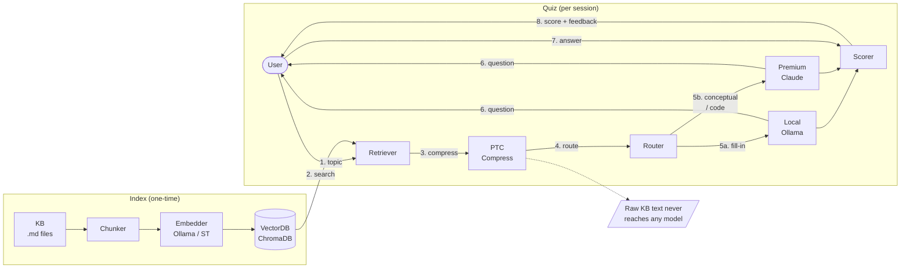

# ai-kb-quiz

> A hybrid multi-model AI quiz app grounded in a vectorized knowledge base.

## What it demonstrates

- **Hybrid model routing** — routes tasks to a local CPU model (Ollama) or premium model (Claude) based on complexity and config
- **PTC (Process-Then-Communicate)** — developer-authored scripts compress large KB context before any model call; raw KB text never reaches a premium model
- **Programmable Tool Calling** — premium model generates Python extraction scripts at runtime, executed in a sandbox; only compact output is returned
- **Vectorized KB semantic search** — ChromaDB-backed semantic retrieval with contextual embedding and top-N sampling for question diversity
- **Optional models** — runs in `local`, `premium`, or `hybrid` mode; graceful degradation if either is absent
- **Extensible KB** — add markdown files, regenerate the index, quiz questions update automatically

## Quick start

```bash
# Install dependencies
pip install -r requirements.txt

# Configure models
cp config/config.example.yaml config/config.yaml
# Edit config.yaml: set mode, local_model, api key env var

# Build the KB vector index (or let quiz auto-index on first run)
python cli/main.py kb index

# Run a quiz
python cli/main.py quiz --topic "EDR architecture"

# View cross-session score summary
python cli/main.py quiz stats

# Search the KB
python cli/main.py kb search "kernel callbacks" --top 5
```

## Project layout

```
ai-kb-quiz/
  kb/                    # Markdown knowledge base (14 files)
  kb_index/              # Vector index (auto-generated, gitignored)
  engine/
    retriever.py         # Semantic search over KB with cross-session deduplication
    indexer.py           # KB vector indexer (incremental, contextual embedding)
    chunker.py           # Markdown → Chunk splitter (H2/H3 boundaries)
    ptc.py               # PTC pipeline: developer-authored extraction scripts
    prog_tool_calling.py # Programmable Tool Calling: model-generated scripts + sandbox exec
    sandbox.py           # RestrictedPython AST + Job Object sandbox
    router.py            # Routes tasks to local or premium model
    scorer.py            # Answer scoring (difflib for fill_in, model eval for conceptual)
    session_log.py       # Per-question JSON session logger
    quiz.py              # Quiz session orchestration
    models/
      adapter.py         # ModelAdapter protocol + MockAdapter
      local_adapter.py   # Ollama HTTP API
      premium_adapter.py # Anthropic SDK
  cli/
    main.py              # CLI entry point (kb, quiz subcommands)
  config/
    config.example.yaml  # Reference config
  docs/
    specs/               # Design spec (ADD + ATAM) + module specs
      modules/           # Per-component PlantUML sources, rendered PNGs, E2E flow diagrams
    superpowers/
      plans/             # TDD implementation plan (Tasks 1–19)
  tests/                 # Pytest suite (all mockable, no live APIs needed)
    unit/
    integration/
    e2e/
  logs/                  # Session JSON logs (gitignored)
```

## Architecture



See [`docs/specs/`](docs/specs/) for the full ADD + ATAM design and
[`docs/specs/modules/`](docs/specs/modules/) for per-component PlantUML diagrams and E2E flow docs.

## Knowledge Base

14 original-content markdown files covering Windows kernel and EDR engineering:

| File | Domain |
|------|--------|
| `edr-architecture-guide.md` | EDR component architecture (C++, kernel/user-mode) |
| `edr-design-reference.md` | EDR design patterns and interfaces |
| `edr-enhancement.md` | Advanced EDR: C++26, BYOVD, concurrency, agentic AI |
| `edr-critical-thinking.md` | Cognitive frameworks for C++ systems and EDR engineering |
| `windows-internals.md` | Windows kernel architecture and EDR telemetry |
| `windows-debugging.md` | WinDbg, kernel debugging, crash analysis |
| `windows-ebpf.md` | Windows eBPF ecosystem — summary |
| `windows-ebpf-overview.md` | Windows eBPF full reference — hook schemas, maps, helpers |
| `kernel-primitives-overview.md` | Object Manager, sync primitives, pool allocation, APC |
| `process-thread-overview.md` | EPROCESS/ETHREAD, PS callbacks, PPL, injection vectors |
| `io-driver-overview.md` | IRP lifecycle, minifilter, IOCTL, WFP callout |
| `boot-virtualization-overview.md` | Secure Boot, VBS/VTL, HVCI, KDP, Credential Guard |
| `critical-thinking-guide.md` | Systems Thinking, Pre-Mortem, 5 Whys, Fishbone, Design Thinking |
| `ai-kd.md` | AI-augmented kernel debugging (AI-KD project design) |

## Status

**Current phase: Implementation** — Design complete. TDD implementation in progress. 96 tests passing, 3 skipped (live Ollama embedding models).

- [x] User stories (Epics 1–10, Gherkin)
- [x] KB content — 14 original-content markdown files
- [x] Design spec (ADD + ATAM, module specs, E2E flow diagrams) — critical thinking review applied
- [x] Project scaffold — `requirements.txt`, `pyproject.toml`, `conftest.py`
- [x] `engine/question.py` — core data types (11 tests)
- [x] `engine/router.py` — hybrid model routing, local/premium/hybrid modes (11 tests)
- [x] `engine/chunker.py` — markdown → Chunk splitter at H2/H3 boundaries (13 tests)
- [x] `engine/store.py` — ChromaDB VectorStore, cosine similarity, upsert-safe, delete_by_source (13 tests)
- [x] `engine/embedder.py` — EmbedFn factory, Ollama + sentence-transformers backends (7 tests)
- [x] `engine/manifest.py` — mtime-based file change tracking, FileDiff (8 tests)
- [x] `engine/context_cache.py` — SHA-256 content-addressed context cache (7 tests)
- [x] `engine/indexer.py` — full + incremental KB indexer, contextual embedding, context cache (9 tests)
- [x] `engine/retriever.py` — semantic search, top-N sampling, IndexNotFoundError (9 tests)
- [ ] `engine/scorer.py` — answer scoring (difflib fill-in, model eval conceptual)
- [ ] `engine/session_log.py` — per-question JSON session logger
- [ ] `engine/ptc.py` — PTC pipeline (developer-authored extraction scripts)
- [ ] `engine/sandbox.py` — RestrictedPython AST + Job Object sandbox
- [ ] `engine/models/` — ModelAdapter protocol, MockAdapter, Ollama, Anthropic SDK
- [ ] `engine/prog_tool_calling.py` — Programmable Tool Calling: model-generated scripts + sandbox exec
- [ ] `engine/quiz.py` — quiz session orchestrator
- [ ] `cli/main.py` — CLI (`quiz`, `kb index`, `kb search`, `quiz stats` subcommands)
- [ ] Scorer calibration — golden eval test set [P0]
- [ ] SeenChunks cross-session deduplication [P1]
- [ ] Ollama fallback routing + auto-index on first run [P1]
- [ ] `quiz stats` cross-session score summary [P2]
- [ ] `--no-ptc` flag, DirectRunner, Literal question types [P3]

## License

MIT
