# End-to-End Flow Diagrams

Visual models for all key scenarios. Each scenario is described from two angles:
- **User perspective** — what the user does, sees, and decides
- **System perspective** — which components are involved and in what order

---

## Component Responsibility Map

High-level block diagram showing each component's ownership, the logical layers
they belong to, and the key architectural boundaries (compression, testability,
index/query consistency).

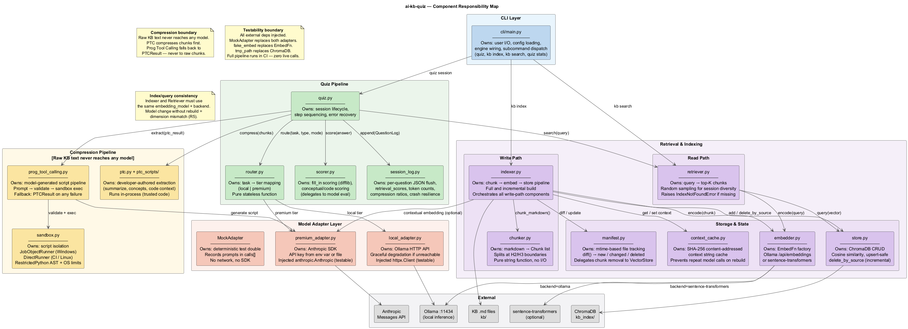

---

## System Component Overview (Wiring)

All modules and their dependency wiring — colour-coded by layer.

| Colour | Layer |
|---|---|
| Blue | CLI |
| Green | Quiz pipeline |
| Yellow | Retrieval / indexing |
| Coral | Model adapters |
| Grey | External dependencies |

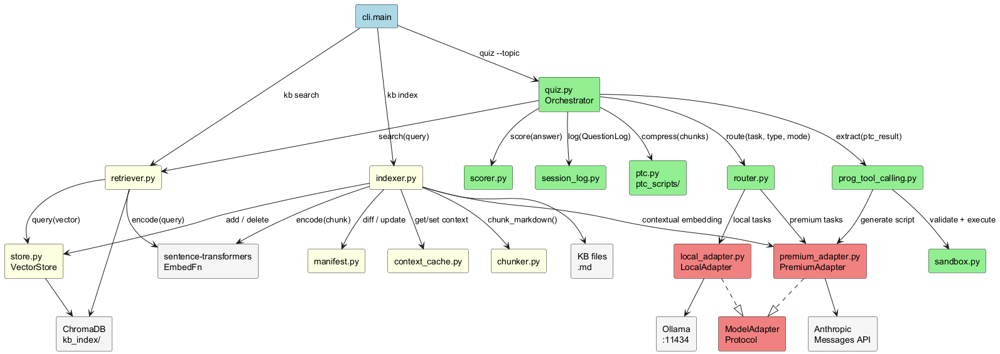

---

## E2E-01: Full KB Index (with Contextual Embedding)

### User perspective

The user runs `kb index` once before their first quiz session, or whenever new KB files are added. They see a progress line per file and a final count of indexed chunks. The command is intentionally slow on first run (one Haiku call per unique chunk for contextual embedding) but fast on subsequent runs because the `ContextCache` avoids repeat model calls.

```
$ python cli/main.py kb index
[kb-index] Full index: 8 files
  Indexing windows-internals.md...
  Indexing edr-sensors.md...
  ...
[kb-index] Done. 47 chunks indexed.
```

### System perspective

CLI → Indexer → chunker → ContextCache (miss → PremiumAdapter, hit → cached) → EmbedFn → VectorStore → Manifest

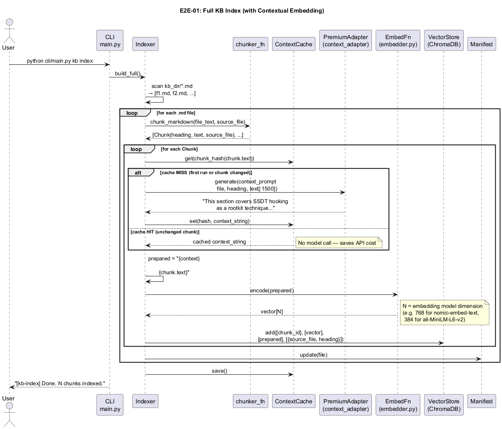

---

## E2E-02: Incremental KB Index

### User perspective

The user runs `kb index --incremental` after editing or adding KB files. Only changed files are re-processed — unchanged files are skipped entirely. The output tells them exactly what changed.

```
$ python cli/main.py kb index --incremental
[kb-index] Incremental: +1 new, ~1 changed, -0 deleted
  Indexed new-topic.md
  Re-indexed windows-internals.md
[kb-index] Done.
```

If they accidentally run it with no changes, nothing happens — the manifest diff returns all-empty lists.

### System perspective

CLI → Indexer → Manifest.diff() → VectorStore.delete_by_source(changed/deleted files) → re-index new + changed → Manifest.update() → ContextCache.save()

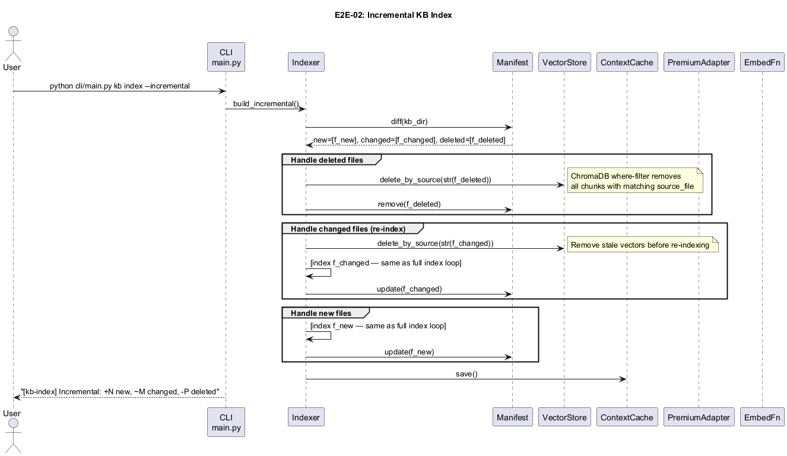

---

## E2E-03: Quiz Session — Conceptual Question (Hybrid Mode)

### User perspective

The user starts a quiz session on a topic. They are shown a question and type a free-text answer. The premium model grades it — they see a score (0, 0.5, or 1.0) and specific feedback explaining what was right or wrong. They can continue to the next question or end the session.

```
$ python cli/main.py quiz --topic "SSDT"

Q1 [conceptual]: Explain how rootkits exploit the SSDT
                 to intercept system calls.

Your answer: By overwriting SSDT entries to redirect
             syscalls to malicious handlers.

Score: 1.0 — Correct!
Feedback: Accurately describes the SSDT overwrite technique.
Correct answer: Rootkits overwrite SSDT entries to redirect
                system calls to their own handlers.

Next question? (Y/N):
```

### System perspective

Retriever (`top_n=20`, sample `top_k=5`, `temperature=0.7` for generation, `0.0` for evaluation) → PTC compression → Programmable Tool Calling → Router (→ premium) → PremiumAdapter generates question → user answers → PremiumAdapter evaluates → Scorer → SessionLog flushes per-question JSON

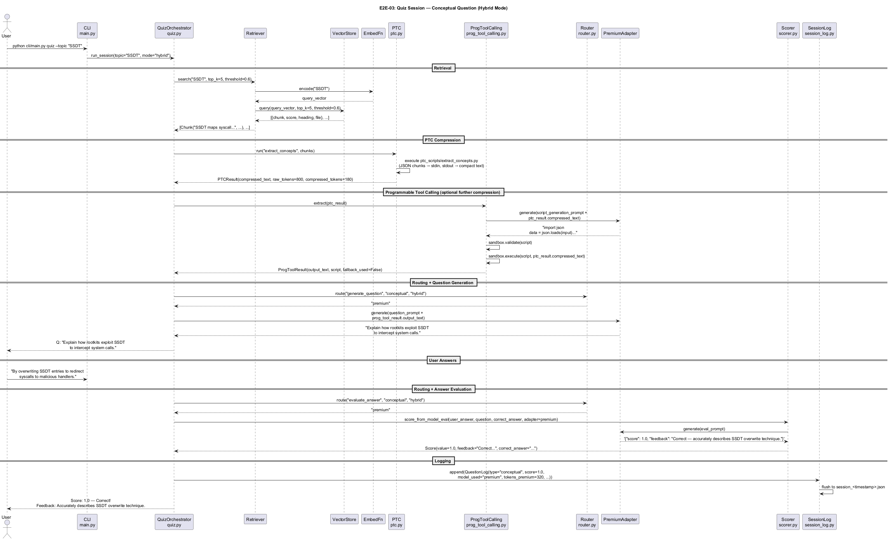

---

## E2E-04: Quiz Session — Fill-in Question (Hybrid Mode)

### User perspective

The user sees a fill-in-the-blank question. The answer is a short specific term, not a paragraph. Scoring is instant (difflib, no model call) — they get immediate feedback. Wrong answers show the correct term.

```
Q2 [fill_in]: The _____ table maps Windows syscall numbers
              to kernel function addresses.

Your answer: SSDT

Score: 1.0 — Correct!
Correct answer: SSDT

Next question? (Y/N):
```

Partial credit (0.5) is awarded for close but incomplete answers (e.g., "System Service Descriptor" without "Table").

### System perspective

Retriever (`top_n=20`, sample `top_k=5`) → Router (→ local) → LocalAdapter generates question (`temperature=0.7`) → user answers → Scorer.score_fill_in() [difflib, no model] → SessionLog. Zero premium API calls for this question type.

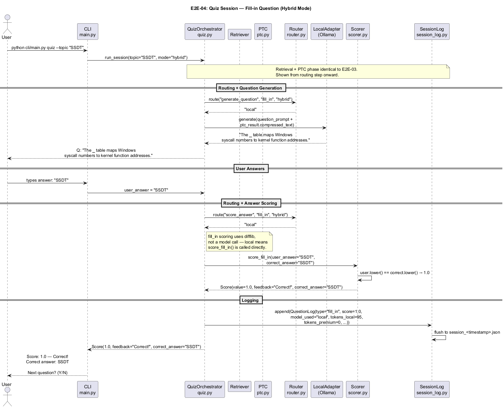

---

## E2E-05: Programmable Tool Calling Pipeline

### User perspective

The user does not directly see this step — it runs transparently between KB retrieval and question generation. Its effect is a higher-quality, more focused question because the model received precisely the information it needed rather than a generic chunk summary.

If the sandbox fails or times out, the quiz continues normally using the PTC-compressed text as fallback — the user never sees an error.

### System perspective

QuizOrchestrator → ProgToolCalling → PremiumAdapter (generate script) → Sandbox.validate() (RestrictedPython AST) → Sandbox.execute() (Job Object resource limits) → ProgToolResult. On any failure at any step: fallback to PTCResult. Raw KB text never reaches the model under any code path.

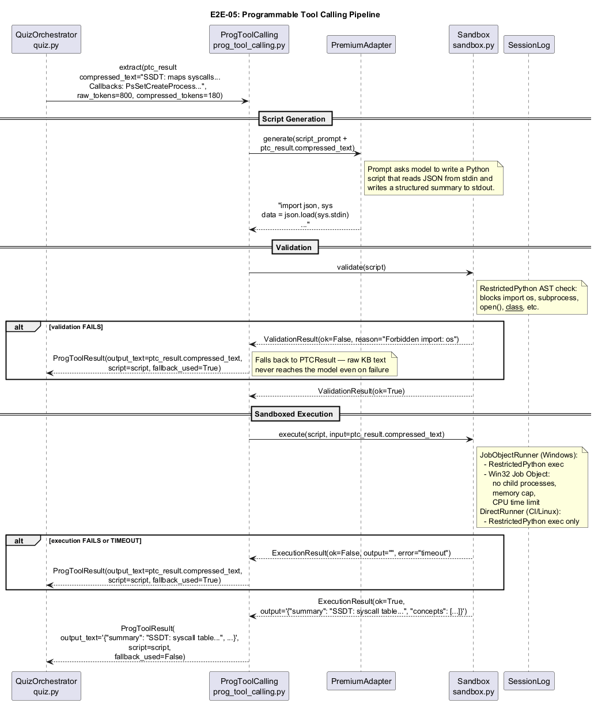

---

## E2E-06: CLI KB Search

### User perspective

The user can search the KB directly without starting a quiz session — useful for exploring what content exists before indexing or for debugging retrieval quality. Results are ranked by semantic similarity score.

```
$ python cli/main.py kb search "kernel callbacks" --top 5

[0.9100] Kernel Callbacks: PsSetCreateProcessNotifyRoutine
         registers a callback invoked on every process...
[0.8400] PsSetCreateProcessNotifyRoutine: Invoked on process
         creation events. Used by EDR sensors to...
[0.7800] EDR Sensor Architecture: Sensors register kernel
         callbacks for process, thread, and image load...
...
```

If the index has not been built yet, they see an actionable error:

```
Error: Index not found. Run: python cli/main.py kb index
```

### System perspective

CLI → Retriever → EmbedFn (encode query) → VectorStore.query() → List[Chunk] sorted by score descending → formatted output. No model calls, no writes.

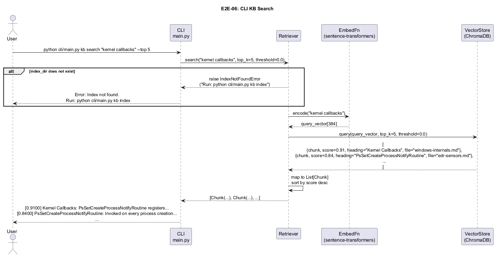

---

---

## E2E-07: kb learn — Initial Explanation

### User perspective

The user runs `kb learn` on a topic they want to study before or after a quiz. They see a structured explanation (Overview / Key Concepts / How They Connect) followed by the KB sources and up to 3 suggested follow-up questions. The REPL prompt then opens for interactive follow-up.

```
$ python cli/main.py kb learn "SSDT"

════════════════════════════════════════════════════════════
  Topic: SSDT  [shallow]
════════════════════════════════════════════════════════════

Overview: The SSDT maps syscall numbers to kernel addresses...
Key Concepts:
  • SSDT — kernel dispatch table for system calls
  • PatchGuard — integrity monitor that detects SSDT tampering
How They Connect: Rootkits overwrite SSDT entries because...
(local)

────────────────────────────────────────────────────────────
Sources:
  • windows-internals.md › SSDT Hooking
  • windows-internals.md › Kernel Callbacks

────────────────────────────────────────────────────────────
Suggested follow-ups:
  [1] How does PatchGuard detect SSDT modifications?
  [2] What is SSDT Shadow and how does it differ?
  [3] How do EDRs use kernel callbacks instead of SSDT hooking?

Ask a follow-up (1-3, your own question, 'quiz', or 'quit'):
```

### System perspective

CLI → `LearnSession.explain(topic)` → Retriever → EmbedFn → VectorStore → PTC (`extract_concepts`) → LocalAdapter (shallow) or PremiumAdapter (deep) → explanation. Then → `LearnSession.suggest(chunks, last_query)` → LocalAdapter (always local) → suggestions. Raw KB text never reaches any model.

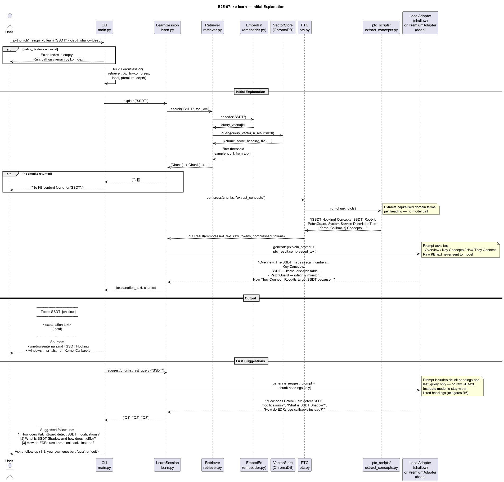

---

## E2E-08: kb learn — REPL Loop (Follow-up + Suggestions)

### User perspective

After the initial explanation the user can ask follow-up questions (typed freely or by picking a numbered suggestion). Each turn produces a fresh answer from the KB and a new set of suggestions. The user can type `quiz` to start a quiz session or `quit` (or Ctrl+C) to exit cleanly.

```
Ask a follow-up (1-3, your own question, 'quiz', or 'quit'): 2
  → What is SSDT Shadow and how does it differ?

The SSDT Shadow is a separate dispatch table used by Win32k.sys...
(local)

────────────────────────────────────────────────────────────
Sources:
  • windows-internals.md › SSDT Shadow

────────────────────────────────────────────────────────────
Suggested follow-ups:
  [1] How does PatchGuard protect SSDT Shadow?
  [2] What is KeServiceDescriptorTable?
  [3] How do AV products hook SSDT Shadow?

Ask a follow-up (1-3, your own question, 'quiz', or 'quit'): quiz
Quiz yourself: python cli/main.py quiz --topic 'SSDT'

Session ended. Tokens used (approx): 420
```

If the follow-up query finds no KB content the REPL shows a message, re-displays the last suggestions, and continues — it never crashes.

### System perspective

CLI → digit/text resolution → `LearnSession.follow_up(query)` (anchored as `"{topic}: {query}"`) → Retriever → VectorStore → PTC (`summarize_chunk`) → adapter → answer. Then → `LearnSession.suggest(new_chunks, last_query)` → LocalAdapter → suggestions. `suggest()` wraps in try/except — returns `[]` on any failure without breaking the REPL.

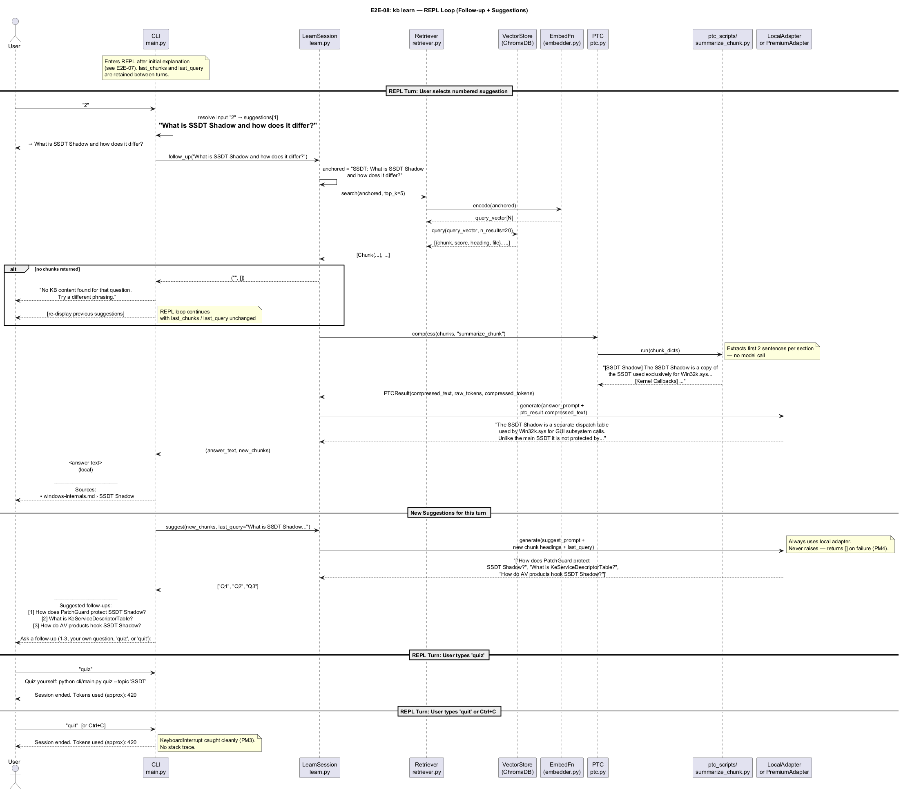

---

## E2E-09: Add New KB Topic and Incremental Index

### User perspective

The user adds a new markdown file to the KB via `kb add`, verifies it appears as "not yet indexed" in `kb list`, then runs `kb index` to pick it up. Only the new file is processed — existing indexed files are skipped.

```
$ python cli/main.py kb add ~/notes/new-topic.md
Added kb/new-topic.md. Run 'python cli/main.py kb index' to index it.

$ python cli/main.py kb list
File                     Indexed   Chunks   Last Modified
───────────────────────────────────────────────────────────────────
existing-topic.md        yes       12       2026-04-10
new-topic.md             no        —        2026-04-19  ⚠

$ python cli/main.py kb index
Incremental index update complete.

$ python cli/main.py kb list
File                     Indexed   Chunks   Last Modified
───────────────────────────────────────────────────────────────────
existing-topic.md        yes       12       2026-04-10
new-topic.md             yes       4        2026-04-19
```

### System perspective

`kb add`: validate suffix, copy to `kb/`, print instruction. `kb index` (incremental): Manifest.diff() detects `new=["new-topic.md"]` → chunker → EmbedFn → VectorStore.add() → Manifest.update(). Unchanged files produce zero model or embed calls.

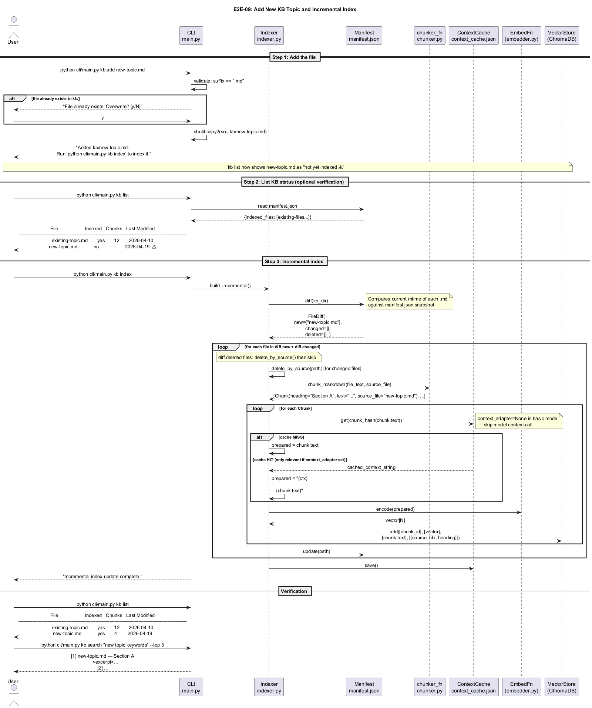

---

## Scenario Comparison

| Scenario | User action | User sees | Premium calls | Local calls | Fallback |
|---|---|---|---|---|---|
| Full KB index | `kb index --rebuild` | Completion message | 1 per unique chunk (context, optional) | — | Cache hit skips model |
| Incremental index | `kb index` | Completion message | 0 (cache hits) | — | — |
| Add + index new topic | `kb add` then `kb index` | List shows ⚠ then yes | 0 | — | — |
| Quiz — conceptual | `quiz --topic X`, free-text answer | Question, score 0/0.5/1.0, feedback | 2 (generate + evaluate) | — | — |
| Quiz — fill_in | `quiz --topic X`, short answer | Question, score 0/0.5/1.0, correct term | 0 | 1 (generate) | difflib scoring |
| Prog Tool Calling | transparent | Nothing (or same quiz question) | 1 (script gen) | — | PTCResult on any failure |
| KB search | `kb search "query"` | Ranked results with scores | 0 | — | IndexNotFoundError |
| kb learn — explain | `kb learn "topic"` | Structured explanation + suggestions | 0 (shallow) or 1 (deep) | 1 (explain) + 1 (suggest) | No explanation if topic not in KB |
| kb learn — follow-up | Type question in REPL | Answer + new suggestions | 0 (shallow) or 1 (deep) | 1 (answer) + 1 (suggest) | Empty retrieve → friendly message, re-show suggestions |
