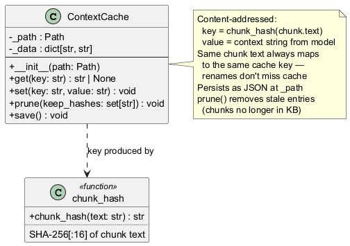

# engine/context_cache.py — ContextCache

Content-addressed cache mapping chunk hashes to model-generated context strings.

## Roles & Responsibilities

**Owns**
- Content-addressed storage of `chunk_hash → context_string` entries
- JSON persistence and loading of the cache file
- Pruning stale entries for chunks no longer present in the KB (`prune()`)
- `chunk_hash()` helper — SHA-256[:16] of chunk text, used as the cache key

**Does not own**
- Generating context strings — that is Indexer's responsibility via `ModelAdapter`
- Deciding when to prune — Indexer calls `prune()` after a full index
- Knowing what a context string means or how it will be used
- Embedding — it stores strings, not vectors

**Collaborates with**
| Collaborator | Relationship |
|---|---|
| `Indexer` | Sole caller — checks cache before calling ModelAdapter, writes on miss |
| `ModelAdapter` | Indirectly — Indexer calls ModelAdapter on cache miss, then writes result here |

## Purpose

Before embedding a chunk, the indexer optionally calls a model to generate a short description of what the chunk is about in its document context (e.g., "This section describes SSDT hooking as a rootkit technique in Windows kernel security"). Generating this context is a model call — expensive if repeated. `ContextCache` stores `chunk_hash → context_string` so that unchanged chunks never trigger a second model call across index rebuilds.

The key is `SHA-256[:16]` of the chunk text, making the cache content-addressed: a chunk that moves between files but has identical text still hits the cache. A chunk whose text changes gets a new hash and re-generates context.

## Public Interface

```python
def chunk_hash(text: str) -> str: ...  # SHA-256[:16]

class ContextCache:
    def __init__(self, path: Path): ...
    def get(self, key: str) -> str | None: ...
    def set(self, key: str, value: str) -> None: ...
    def prune(self, keep_hashes: set[str]) -> None: ...
    def save(self) -> None: ...
```

`prune()` is called after a full index to remove entries for chunks no longer in the KB, preventing unbounded cache growth. `save()` must be called explicitly.

## Class Diagram



## Error Cases

| Condition | Behaviour |
|---|---|
| Cache file does not exist on init | Starts empty — normal first-run behaviour |
| Cache file exists but is empty | Guarded by `stat().st_size > 0` check before `json.load` |
| `get()` for unknown key | Returns `None` — caller falls through to model call |

## Config Knobs

| Parameter | Notes |
|---|---|
| Cache path | Passed from `Indexer` via `config.yaml` `index_dir` (stored as `context_cache.json` alongside the index) |
