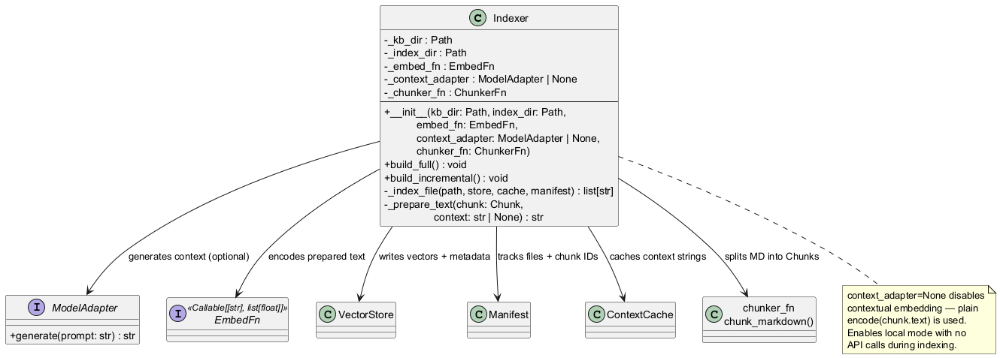
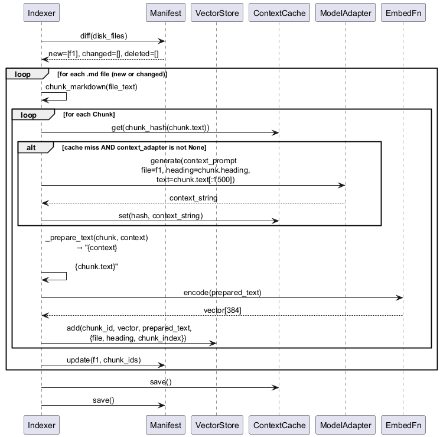

# engine/indexer.py — Indexer

Orchestrates full and incremental KB indexing: chunk → contextualise → embed → store.

## Roles & Responsibilities

**Owns**
- The entire write path from KB markdown files to the vector index
- Orchestrating the pipeline: scan → chunk → contextualise → embed → store
- Coordinating all sub-components (VectorStore, Manifest, ContextCache, ModelAdapter, EmbedFn)
- Ensuring stale chunk IDs are removed from VectorStore before a file is re-indexed
- Enforcing the invariant: raw KB text never reaches a model (context prompt uses only heading + 1500-char excerpt)
- Deciding when contextual embedding is active (`context_adapter is not None`)

**Does not own**
- Storage format or query execution — delegated to `VectorStore`
- File change detection — delegated to `Manifest`
- Context string caching — delegated to `ContextCache`
- Generating the embedding vector — delegated to `EmbedFn`
- Generating context strings — delegated to `ModelAdapter`
- Splitting markdown into chunks — delegated to `chunker_fn`

**Collaborates with**
| Collaborator | Role in pipeline |
|---|---|
| `VectorStore` | Writes vectors and metadata; deletes stale IDs |
| `Manifest` | Queries diff for incremental mode; updates after each file |
| `ContextCache` | Checks for cached context; writes on miss; saves at end |
| `ModelAdapter` | Called on cache miss to generate context string |
| `EmbedFn` | Encodes prepared text (context + chunk) to vector |
| `chunker_fn` | Splits each `.md` file into `List[Chunk]` |

## Purpose

The indexer is the only component that writes to the vector index. It wires together `VectorStore`, `Manifest`, `ContextCache`, a `ModelAdapter` (for contextual embedding), and an `EmbedFn` (sentence-transformers). The pipeline ensures that:

1. Raw KB text never reaches a model directly — context generation uses only the chunk heading and a 1500-character excerpt.
2. The same chunk text never triggers more than one context-generation call across all index runs (ContextCache).
3. Deleted and changed files have their stale chunk IDs removed from the VectorStore before re-indexing (Manifest).

Setting `context_adapter=None` disables contextual embedding entirely — the indexer falls back to `encode(chunk.text)`. This enables local-mode operation with zero API calls during indexing.

## Public Interface

```python
EmbedFn = Callable[[str], list[float]]

class Indexer:
    def __init__(
        self,
        kb_dir: Path,
        index_dir: Path,
        embed_fn: EmbedFn,
        context_adapter: ModelAdapter | None = None,
        chunker_fn: Callable = chunk_markdown,
    ): ...

    def build_full(self) -> None: ...
    def build_incremental(self) -> None: ...
```

## Class Diagram



## Sequence Diagram — Incremental Index



## Context Prompt Template

```
You are helping index a knowledge base.
Provide a 1-2 sentence description of what the following section is about,
for use as retrieval context. Be specific about the topic domain.

File: {file_path}
Section: {heading}

{chunk_text[:1500]}
```

## Error Cases

| Condition | Behaviour |
|---|---|
| `kb_dir` does not exist | Raises `FileNotFoundError` on scan |
| `context_adapter` returns empty string | Stored as-is; empty context is safe (same as no context) |
| Embed function raises | Propagates — no partial writes for that chunk |
| `build_incremental()` with no manifest | Equivalent to `build_full()` (Manifest starts empty) |

## Config Knobs

| Parameter | Default | Notes |
|---|---|---|
| `context_adapter` | `None` | Set to `premium_adapter` in hybrid/premium mode |
| `embed_fn` | injected | Typically `SentenceTransformer.encode` |
| `index_dir` | from `config.yaml` | Also controls manifest and cache paths |
