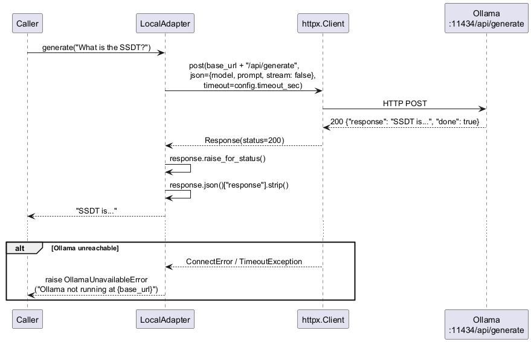

# engine/models/local_adapter.py — LocalAdapter

Calls a locally running Ollama instance via HTTP to generate text responses.

## Roles & Responsibilities

**Owns**
- Translating `generate(prompt)` calls into Ollama HTTP API requests (`POST /api/generate`)
- Unpacking the JSON response and returning the text content
- Raising `OllamaUnavailableError` when the Ollama process is unreachable — with an actionable message
- Enforcing `raise_for_status()` on non-2xx responses

**Does not own**
- Which model to use — injected via constructor (`model` param from `config.yaml`)
- Which tasks are sent to local — that is `router.py`'s routing decision
- Prompt construction — the calling component builds the prompt
- Retry logic or backoff — not implemented; failures propagate immediately
- Context embedding during indexing — that goes to `PremiumAdapter`

**Collaborates with**
| Collaborator | Relationship |
|---|---|
| `ModelAdapter` protocol | Implements it — swappable anywhere `ModelAdapter` is expected |
| `httpx.Client` | Injected HTTP client — mockable in tests without monkey-patching |
| Ollama process | External runtime dependency — must be running on `base_url` |
| `router.py` | Upstream decision-maker that selects local vs premium |
| `quiz.py` | Runtime caller |

## Tasks Routed to Local (Hybrid Mode)

| Task | Question type | Rationale |
|---|---|---|
| `summarize_chunk` | — | Factual compression, no deep reasoning needed |
| `generate_question` | `fill_in` | Factual recall — straightforward templating |
| `evaluate_answer` | `fill_in` | Pattern/fuzzy match sufficient |
| `score_answer` | any | Numerical scoring; difflib handles fill_in |

## Public Interface

```python
class OllamaUnavailableError(RuntimeError): ...

class LocalAdapter:
    def __init__(
        self,
        model: str,
        base_url: str = "http://localhost:11434",
        client: httpx.Client | None = None,
    ): ...

    def generate(self, prompt: str, temperature: float = 0.7) -> str: ...
```

`temperature` is passed to Ollama via `options.temperature` in the request body. Caller sets it per use case — `0.7` for question generation (variety), `0.0` for scoring (deterministic).

`client` defaults to a fresh `httpx.Client()` if not injected — allows production use without boilerplate while keeping tests fully injectable.

## Sequence Diagram



## Error Cases

| Condition | Behaviour |
|---|---|
| Ollama process not running | Raises `OllamaUnavailableError("Ollama not running at {base_url}. Start with: ollama serve")` |
| HTTP timeout | Raises `OllamaUnavailableError` wrapping `httpx.TimeoutException` |
| Non-2xx response | `raise_for_status()` propagates `httpx.HTTPStatusError` |
| Empty response text | Returns empty string — caller decides if that is an error |

## Config Knobs

| Parameter | Default | Source |
|---|---|---|
| `model` | e.g. `"qwen2.5:7b"` | `config.yaml` `local_model` |
| `base_url` | `"http://localhost:11434"` | `config.yaml` `ollama_base_url` |
| `timeout_sec` | `60` | `config.yaml` `local_timeout_sec` |
