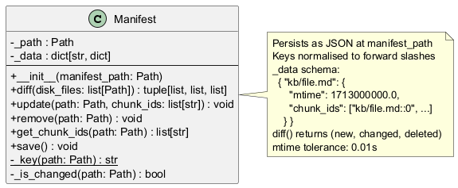
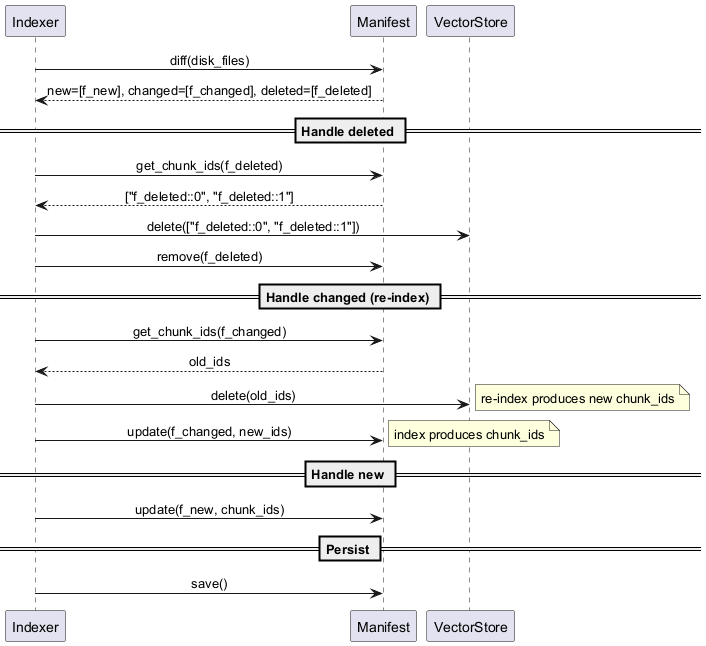

# engine/manifest.py — Manifest

Tracks which KB files have been indexed and their chunk IDs, enabling incremental rebuilds.

## Roles & Responsibilities

**Owns**
- Mapping of KB file paths to their last-indexed `mtime` and chunk IDs
- Detecting which files are new, changed, or deleted since the last index run (`diff()`)
- JSON persistence of that mapping to disk (`save()`)
- Cross-platform path normalisation (forward slashes as canonical keys)

**Does not own**
- The actual chunk text or vectors — it only tracks IDs
- Deciding what to do with new/changed/deleted files — that is Indexer's orchestration responsibility
- Reading file contents — it only reads `mtime` via `stat()`
- Deleting old vectors from VectorStore — it provides chunk IDs; Indexer calls `VectorStore.delete()`

**Collaborates with**
| Collaborator | Relationship |
|---|---|
| `Indexer` | Sole caller — drives all reads and writes |
| Filesystem | Reads `path.stat().st_mtime` to detect changes |

## Purpose

Persists a JSON map of `file_path → {mtime, chunk_ids}`. On incremental index, `diff()` compares the on-disk file set against the manifest to produce new/changed/deleted lists. The indexer uses these lists to add only what changed and delete stale chunk IDs from the VectorStore.

## Public Interface

```python
class Manifest:
    def __init__(self, manifest_path: Path): ...
    def diff(self, disk_files: list[Path]) -> tuple[list[Path], list[Path], list[Path]]: ...
    # returns (new, changed, deleted)
    def update(self, path: Path, chunk_ids: list[str]) -> None: ...
    def remove(self, path: Path) -> None: ...
    def get_chunk_ids(self, path: Path) -> list[str]: ...
    def save(self) -> None: ...
```

Keys are stored with forward slashes for cross-platform consistency. `save()` must be called explicitly — the manifest is not auto-flushed.

## Class Diagram



## Sequence Diagram — Incremental Index



## Error Cases

| Condition | Behaviour |
|---|---|
| `manifest_path` does not exist on init | Starts with empty `_data` — first run is a full index |
| `get_chunk_ids()` for unknown path | Returns `[]` |
| `remove()` for unknown path | No-op (`dict.pop` with default) |
| mtime tolerance | `abs(mtime_disk - mtime_stored) > 0.01` — avoids float rounding false-positives |

## Config Knobs

None — manifest path is passed by the indexer from `config.yaml` `index_dir`.
