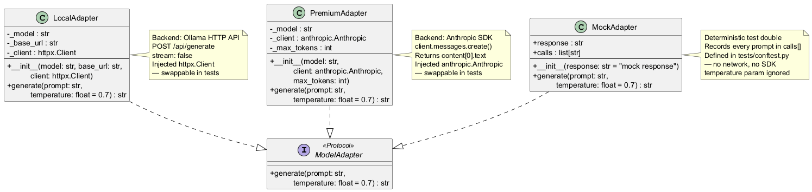

# engine/models/adapter.py — ModelAdapter Protocol

Single-method interface that decouples all engine components from any specific model backend.

## Roles & Responsibilities

**Owns**
- Defining the contract every model backend must satisfy: `generate(prompt: str) -> str`
- Providing `MockAdapter` — the deterministic test double used across all unit and integration tests
- Enabling dependency injection throughout the engine — no component imports an SDK directly

**Does not own**
- How inference is performed — each implementor owns its own backend
- Routing decisions — `router.py` decides which adapter instance to call
- Prompt construction — the calling component (scorer, quiz, indexer) constructs the prompt
- Token counting or cost tracking — that is `session_log.py`'s responsibility

**Collaborates with**
| Collaborator | Relationship |
|---|---|
| `LocalAdapter` | Concrete implementor — Ollama HTTP backend |
| `PremiumAdapter` | Concrete implementor — Anthropic SDK backend |
| `MockAdapter` | Test double — defined in `tests/conftest.py` |
| Every engine component that calls a model | Depends on this interface, not on a concrete class |

## Protocol Definition

```python
from typing import Protocol

class ModelAdapter(Protocol):
    def generate(self, prompt: str, temperature: float = 0.7) -> str: ...
```

Structural subtyping — any class with a matching `generate` signature satisfies the protocol without explicit inheritance. `MockAdapter`, `LocalAdapter`, and `PremiumAdapter` all qualify.

`temperature` is a per-call decision made by the caller, not baked into the adapter:

| Call site | Temperature | Rationale |
|---|---|---|
| Question generation | `0.7` | Creative variety — different phrasing each run |
| Answer evaluation | `0.0` | Deterministic — consistent scoring for the same answer |
| Contextual embedding | `0.0` | Consistent descriptions — same chunk → same context string |
| PTC script generation | `0.2` | Mostly deterministic scripts with slight variation |

## MockAdapter

```python
class MockAdapter:
    def __init__(self, response: str = "mock response"):
        self.response = response
        self.calls: list[str] = []

    def generate(self, prompt: str, temperature: float = 0.7) -> str:
        self.calls.append(prompt)
        return self.response
```

`MockAdapter` ignores `temperature` — tests are always deterministic regardless of the value passed. `calls` lets tests assert which prompts were sent and how many times the adapter was invoked — critical for verifying `ContextCache` hit/miss behaviour in indexer tests.

## Class Diagram — All Adapters


