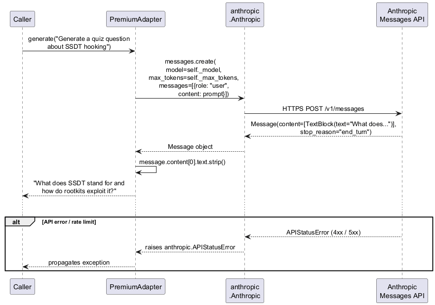

# engine/models/premium_adapter.py — PremiumAdapter

Calls the Anthropic Messages API via the official SDK to generate high-quality text responses.

## Roles & Responsibilities

**Owns**
- Translating `generate(prompt)` calls into `client.messages.create()` SDK calls
- Extracting the text content from the first `TextBlock` in the response
- Propagating SDK exceptions (`anthropic.APIStatusError`, `anthropic.APIConnectionError`) to the caller

**Does not own**
- Which tasks are sent to premium — that is `router.py`'s decision
- Prompt construction — the calling component (quiz, scorer, indexer) builds the prompt
- Rate-limit retry logic — not implemented; SDK exceptions propagate immediately
- Token usage tracking — `session_log.py` is responsible for logging token counts
- API key management — key is set in environment (`ANTHROPIC_API_KEY`) before the client is constructed; the adapter never reads it directly

**Collaborates with**
| Collaborator | Relationship |
|---|---|
| `ModelAdapter` protocol | Implements it — swappable anywhere `ModelAdapter` is expected |
| `anthropic.Anthropic` | Injected SDK client — mockable in integration tests |
| `router.py` | Upstream decision-maker that selects premium vs local |
| `quiz.py` | Runtime caller for question generation and answer evaluation |
| `Indexer` | Runtime caller for contextual embedding context generation |
| `prog_tool_calling.py` | Runtime caller for Programmable Tool Calling script generation |

## Tasks Routed to Premium (Hybrid Mode)

| Task | Question type | Rationale |
|---|---|---|
| `generate_question` | `conceptual` | Requires reasoning about concepts, not just factual recall |
| `generate_question` | `code` | Requires understanding code patterns and producing precise questions |
| `evaluate_answer` | `conceptual` | Nuanced judgment — partial credit, rephrased correct answers |
| `evaluate_answer` | `code` | Semantic equivalence of code answers requires deep understanding |
| Contextual embedding | — | Generates 1–2 sentence chunk descriptions during indexing |
| Programmable Tool Calling | — | Generates Python extraction scripts at runtime |

## Public Interface

```python
class PremiumAdapter:
    def __init__(
        self,
        model: str = "claude-haiku-4-5-20251001",
        client: anthropic.Anthropic | None = None,
        max_tokens: int = 1024,
    ): ...

    def generate(self, prompt: str, temperature: float = 0.7) -> str: ...
```

`temperature` is passed directly to `messages.create(temperature=...)`. Caller sets it per use case — `0.7` for question generation (creative variety), `0.0` for answer evaluation and contextual embedding (consistent, deterministic output).

`client` defaults to `anthropic.Anthropic()` (reads `ANTHROPIC_API_KEY` from environment) if not injected — allows production use without boilerplate while keeping integration tests injectable.

## Sequence Diagram



## Error Cases

| Condition | Behaviour |
|---|---|
| Invalid or missing API key | SDK raises `anthropic.AuthenticationError` — propagates to caller |
| Rate limit hit | SDK raises `anthropic.RateLimitError` — propagates; no retry |
| Network unreachable | SDK raises `anthropic.APIConnectionError` — propagates |
| Response has no text block | Raises `ValueError("No text content in response")` |

## Config Knobs

| Parameter | Default | Source |
|---|---|---|
| `model` | `"claude-haiku-4-5-20251001"` | `config.yaml` `premium_model` |
| `max_tokens` | `1024` | `config.yaml` `premium_max_tokens` |
| API key | — | `ANTHROPIC_API_KEY` environment variable |
