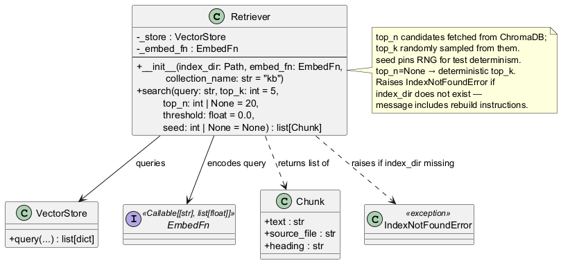
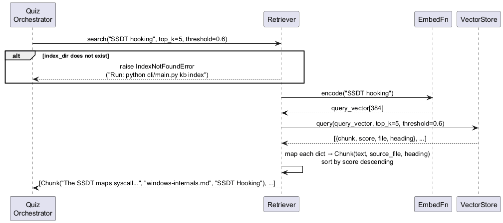

# engine/retriever.py — Retriever

Encodes a query and returns the top-K most semantically similar KB chunks.

## Roles & Responsibilities

**Owns**
- The entire read path from query string to ranked and randomly sampled `List[Chunk]`
- Encoding the query string to a vector using the same `EmbedFn` used at index time
- Fetching a wider candidate pool (`top_n`) from VectorStore and randomly sampling `top_k` from it — ensuring different chunks are returned across quiz sessions on the same topic
- Mapping raw `VectorStore` result dicts back to `Chunk` dataclass instances
- Raising `IndexNotFoundError` with an actionable rebuild message when the index is missing

**Does not own**
- Building or updating the index — that is exclusively Indexer's responsibility
- Caching query results — each `search()` call hits the index fresh
- Deciding `top_k`, `top_n`, or `threshold` values — caller supplies all three
- File tracking or change detection

**Collaborates with**
| Collaborator | Role |
|---|---|
| `VectorStore` | Issues the cosine similarity query; receives raw result dicts |
| `EmbedFn` | Encodes the query string to a vector |
| `Chunk` dataclass | Maps result dicts to typed output |

## Purpose

The retriever is the read-side counterpart to the indexer. It encodes the query string using the same `EmbedFn` used during indexing, delegates to `VectorStore.query()`, and maps the raw result dicts back to `List[Chunk]` sorted by descending similarity score. It is stateless between calls.

## Public Interface

```python
class IndexNotFoundError(Exception): ...

class Retriever:
    def __init__(
        self,
        index_dir: Path,
        embed_fn: EmbedFn,
        collection_name: str = "kb",
    ): ...

    def search(
        self,
        query: str,
        top_k: int = 5,
        top_n: int | None = 20,
        threshold: float = 0.0,
        seed: int | None = None,
    ) -> list[Chunk]: ...
```

`search()` fetches `top_n` candidates from VectorStore, then randomly samples `top_k` from them — ensuring different chunks are returned across sessions on the same topic. When `top_n is None` or `top_n <= top_k`, sampling is skipped and the top-K are returned deterministically.

`seed` pins the RNG — used in tests to assert specific sampling behaviour without live randomness.

Raises `IndexNotFoundError` if `index_dir` does not exist, with a message including the CLI rebuild command.

## Class Diagram



## Sequence Diagram



## Error Cases

| Condition | Behaviour |
|---|---|
| `index_dir` missing | Raises `IndexNotFoundError` with rebuild instructions |
| All results below `threshold` | Returns `[]` — valid empty result, not an error |
| Empty index (no chunks indexed) | `VectorStore.query()` returns `[]`; propagated as `[]` |

## Config Knobs

| Parameter | Default | Notes |
|---|---|---|
| `top_k` | `5` | Chunks returned to caller; tune via `config.yaml` `retriever.top_k` |
| `top_n` | `20` | Candidate pool size; must be ≥ top_k; tune via `config.yaml` `retriever.top_n` |
| `threshold` | `0.0` | Tune via `config.yaml` `retriever.similarity_threshold`; ATAM sensitivity point S1 |
| `collection_name` | `"kb"` | Must match the name used during indexing |
| `seed` | `None` | Set only in tests for deterministic sampling |
