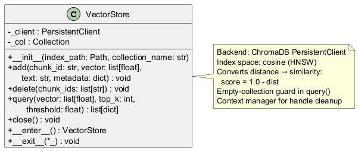
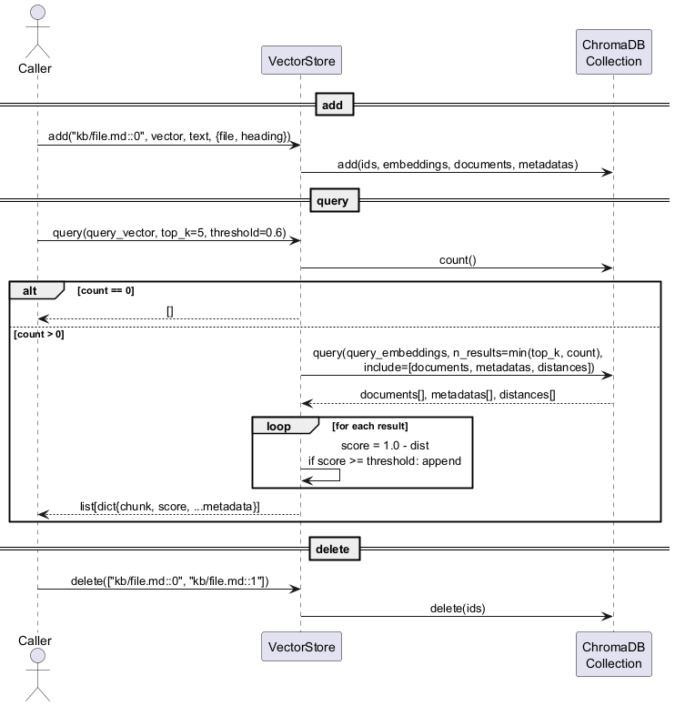

# engine/store.py — VectorStore

ChromaDB wrapper providing add, delete, and threshold-filtered cosine similarity query.

## Roles & Responsibilities

**Owns**
- Persistence of vectors and metadata to disk via ChromaDB `PersistentClient`
- Cosine distance → similarity score conversion (`score = 1.0 - dist`)
- Threshold filtering of query results
- Empty-collection safety guard (prevents ChromaDB raising when `n_results > count`)
- File handle lifecycle via context manager (`close()` on exit)

**Does not own**
- What content gets stored — caller (Indexer) decides chunk text and metadata
- When to add or delete — caller drives all writes
- How vectors are produced — embedding is external (EmbedFn)
- File change detection — that is Manifest's responsibility

**Collaborates with**
| Collaborator | Relationship |
|---|---|
| `chromadb` SDK | Internal dependency — hidden behind this interface |
| `Indexer` | Primary write caller (`add`, `delete`) |
| `Retriever` | Primary read caller (`query`) |

## Purpose

Encapsulates all ChromaDB operations behind a three-method interface so the rest of the engine has no direct dependency on the ChromaDB SDK. The collection uses cosine space (HNSW index); distances are converted to similarity scores before returning.

## Public Interface

```python
class VectorStore:
    def __init__(self, index_path: Path, collection_name: str): ...
    def add(self, chunk_id: str, vector: list[float], text: str, metadata: dict) -> None: ...
    def delete(self, chunk_ids: list[str]) -> None: ...
    def query(self, vector: list[float], top_k: int = 5, threshold: float = 0.0) -> list[dict]: ...
    def close(self) -> None: ...
    def __enter__(self) / __exit__(self, *_): ...  # context manager
```

`query()` returns a list of dicts, each containing all metadata fields plus `chunk` (document text) and `score` (float 0–1, higher = more similar). Results below `threshold` are excluded.

## Class Diagram



## Sequence Diagram



## Error Cases

| Condition | Behaviour |
|---|---|
| `query()` on empty collection | Returns `[]` (guards against ChromaDB raising on `n_results > count`) |
| `delete([])` | No-op (ChromaDB raises on empty id list) |
| `close()` on client without `.close()` | Checks with `getattr` — safe no-op |

## Config Knobs

| Parameter | Default | Notes |
|---|---|---|
| `collection_name` | caller-supplied | Passed from `Indexer`/`Retriever`; default `"kb"` |
| `hnsw:space` | `"cosine"` | Set at collection creation; cannot be changed after |
| `threshold` | `0.0` | Applied post-query; tune via `config.yaml` `similarity_threshold` |
